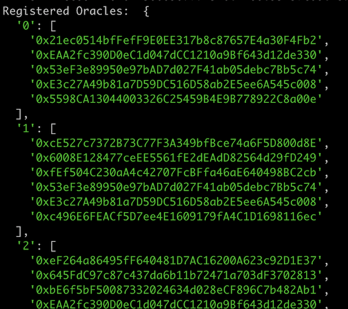
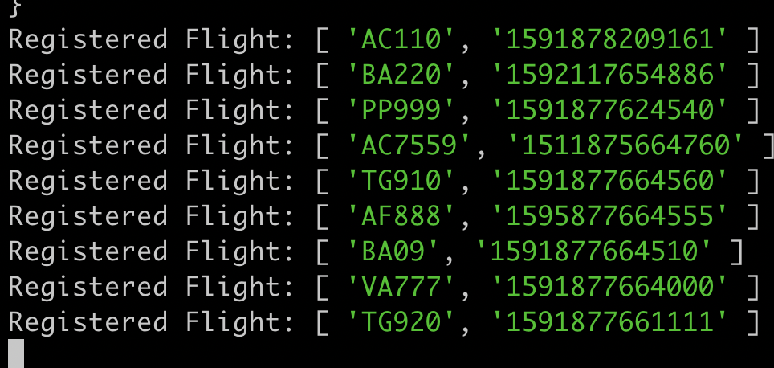
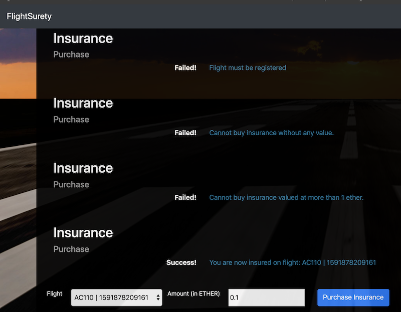
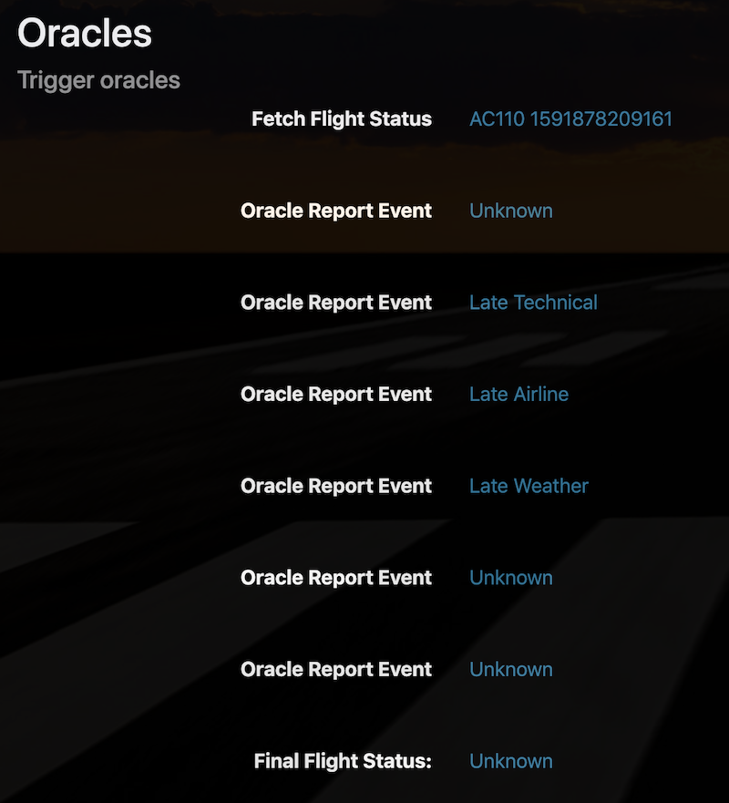

# FlightSurety

[](https://travis-ci.org/jensendarren/FlightSurety)

This is a blockchain Dapp that makes use of Oracles to determine if flights are delayed and the reason for the delay. This information is then used to determine if insured passengers can get a payout and for how much.

## Run the full application locally

After cloning this repo you will need to start several services to run this application. The services are:

* Ganache
* Server
* Client
* Truffle

Below are details on how to start each service:

### Ganache

Ganache needs to be started up with specific commmand line arguments so that the tests and application run correctly. So open a terminal window and run:

```
ganache-cli -a 50 --gasLimit 300000000 --gasPrice 20000000000 -m 'candy maple cake sugar pudding cream honey rich smooth crumble sweet treat'
```

### Truffle

Truffle is needed to compile, test and deploy the contracts. In a new terminal window run the following truffle commands:

```
truffle compile
truffle migrate --reset
truffle test
```

The last truffle command shown above runs all the tests which should all pass just as they are on [Travis CI](https://travis-ci.org/jensendarren/FlightSurety). If the tests are not passing as expected then please reach out to me.

### Server

The server app simulates the Oracles. To start the server, open a terminal window and run the following:

```
npm run server
```

When the server starts up it registers 20 Oracles and 8 Flights which will be utilized when running the client later. Watch the output of the server logs in the console and you should see the Oracles and Flights registration list, something like this:

**Registered Oracles**



**Registered Flights**




If the server does not start up or you do not see the Oracles and Flights being registered please reach out to me.

### Client

The client is the front end of the Dapp. Its a prototype application to test out the Smart Contracts on a local ganache network without requiring the use of MetaMask. For the app to run you must have already completed the above steps to start ganache and the server.

Now, you can start it up with the following command:

```
npm run dapp
```

Now open a new browser window at [http://localhost:8000](http://localhost:8000) to test our the Dapp.

The app should handle all requirement validation errors properly and display prompts on the screen to help you.

### Testing

As mentioned above this repo comes with a set of Truffle Tests which can be run at the command line as follows:

```
truffle test
```

Its also possible to **test out the application via the client Dapp**. In the client application its possible to interact with the Smart Contract in two ways:

* Purchase insurance for any of the pre-registered flights
* Request the Oracles to report back on flight status

To purchase insurance, simply select the flight from the drop down, enter the amount (in Ether) that you want to be insured for and subnit the form. You should see a message in the app confirming that you are insured for the selected flight!

There is some validation and its possible that you will see some validation errors if you:

* Do not select a flight from the drop down
* Do not enter any Ether
* Enter more Ether than is available in the test account
* Purchase the insurance for the same flight more than once

### Client Sreenshots

When testing the client Dapp you should see output similar as this:

**Purchase Insurance Test**



**Request Flight Status from Oracles Test**



### Issue Reporting

If you experience with bugs or need further improvement, please create a new issue under [Issues](https://github.com/jensendarren/star-notary-ethereum-dapp-cryptostar/issues).


### Contributing to the FlightSurety App!

Pull requests are very welcome. Before submitting a pull request, please make sure that your changes are well tested. Pull requests without tests will not be accepted. In this project we currently use Truffle Tests.

### Authors

This **FlightSurety** application was developed as part of the Blockchain Nanodegree with [Udacity](http://www.udacity.com) and [Darren Jensen](http://www.tweetegy.com).

### License

This **FlightSurety** application is released under [AGPL](http://www.gnu.org/licenses/agpl-3.0-standalone.html)

### Disclaimer

This application is part of a _project assignment_ and is most definitely __not__ suitable for Production use! :)

### Remaining issues / ideas

* Complete features in the Dapp client
* Set style for _Final Flight Status_ to stand out

### Resources

* [How does Ethereum work anyway?](https://medium.com/@preethikasireddy/how-does-ethereum-work-anyway-22d1df506369)
* [BIP39 Mnemonic Generator](https://iancoleman.io/bip39/)
* [Truffle Framework](http://truffleframework.com/)
* [Ganache Local Blockchain](http://truffleframework.com/ganache/)
* [Remix Solidity IDE](https://remix.ethereum.org/)
* [Solidity Language Reference](http://solidity.readthedocs.io/en/v0.4.24/)
* [Ethereum Blockchain Explorer](https://etherscan.io/)
* [Web3Js Reference](https://github.com/ethereum/wiki/wiki/JavaScript-API)